# Claude 对话浏览器 — 技术文档

> **版本:** 2.0  
> **技术栈:** Python 3.10+ / Flask / Vanilla JS / highlight.js / marked.js  
> **目标平台:** Windows (macOS/Linux 兼容)

---

## 1. 项目概述

Claude 对话浏览器是一个本地 Web 应用，支持 **Claude.ai 官方 JSON** 和 **Claude Code JSONL** 两种数据源。核心价值在于将机器可读的深层嵌套 JSON（15 种内容块类型）转换为接近 Claude 网页版体验的可读格式。

> **数据说明**：文档中出现的所有数字（对话数、消息数、文件大小等）均来自开发测试集，仅用于说明规模量级，不代表所有用户的数据特征。

### 设计目标

| 目标 | 实现方式 |
|------|---------|
| 零前端构建 | Flask 渲染单页 HTML，CDN 加载 highlight.js / marked.js |
| 最小依赖 | 仅 `flask>=3.0` 一个 pip 依赖 |
| 即时启动 | `启动.bat` 一键启动，自动加载 `chat_history/` 目录 |
| 优雅重启 | `connect_ex` 端口检测 + `--restart` 自动杀旧进程 |
| 服务端渲染 | Python 渲染内容块为 HTML 片段，前端 marked.js 做 Markdown 二次渲染 |
| 双格式支持 | Claude.ai JSON 数组 + Claude Code JSONL（27 种事件类型） |
| 大对话性能 | 分块渐进渲染 + 数据驱动导航 + content-visibility 跳过视口外渲染 |

---

## 2. 架构设计

### 2.1 整体架构

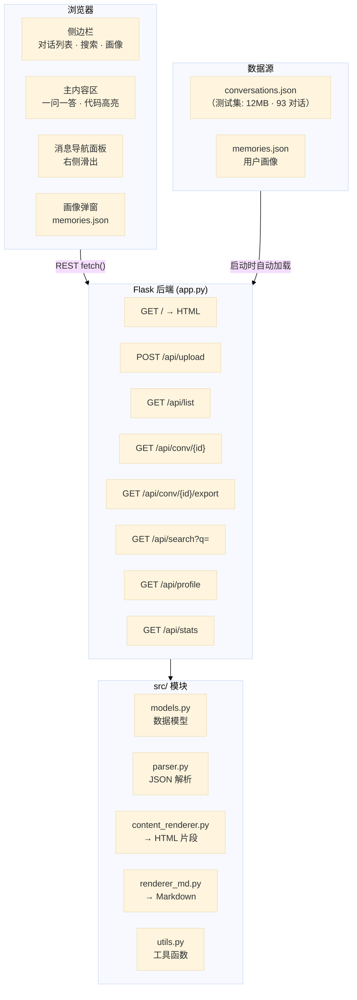

### 2.2 设计原则

1. **服务端渲染 HTML 片段，客户端渲染 Markdown**：结构由服务端控制（免受 XSS），文风由 marked.js 在浏览器处理
2. **单一数据源**：对话数据在服务端以 `Conversation` 对象常驻，前端仅缓存列表摘要
3. **渐进增强**：JS 失效时仍可看到原始 HTML，highlight.js / marked.js 从 CDN 加载失败不影响基本阅读
4. **O(1) 查找路径**：`_conversation_index` 字典将 UUID 查找从线性扫描优化为常数时间

---

## 3. 数据流

### 3.1 JSON 解析流程

```mermaid
flowchart TD
    FILE["conversations.json<br/>（测试集: 12MB）"] --> READ["f.read() 一次性读入"]
    READ --> STRIP["content.lstrip()<br/>跳过 BOM + 空白"]
    STRIP --> DETECT{"首字符检测"}
    DETECT -->|"["| JSON["json.loads()<br/>JSON 数组"]
    DETECT -->|"{"| JSONL["_parse_jsonl()<br/>逐行解析"]

    JSON --> ITER["遍历对话列表"]
    JSONL --> ITER

    ITER --> PARSE_CONV["_parse_conversation()"]
    PARSE_CONV --> PARSE_MSG["_parse_message()<br/>遍历 chat_messages"]
    PARSE_MSG --> PARSE_BLOCK["_parse_content_block()<br/>15 种类型分发"]

    PARSE_BLOCK --> BLOCK_TYPES["text · thinking · tool_use<br/>tool_result · code_block · ..."]

    BLOCK_TYPES --> RESULT["List&#91;Conversation&#93;<br/>对话列表（测试集: 93 对话 · 2338 消息）"]
    RESULT --> INDEX["_conversation_index<br/>{uuid → Conversation}<br/>O(1) 查找"]
```

### 3.2 内容块渲染流程

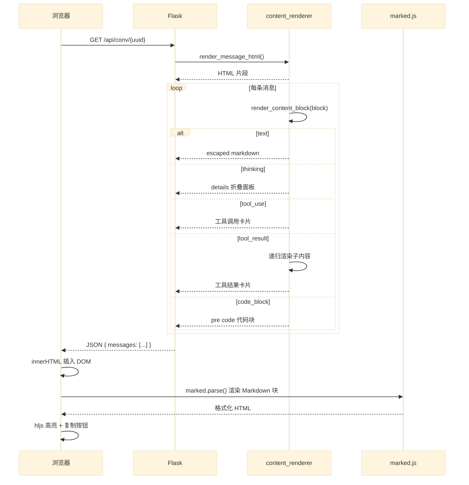

### 3.3 Markdown 导出流程

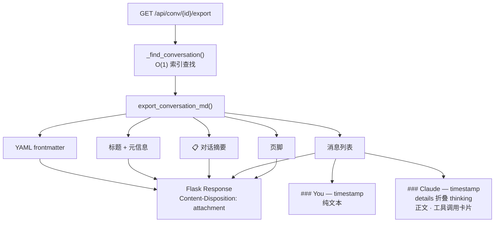

---

## 4. 模块详解

### 4.1 `src/models.py` — 数据模型

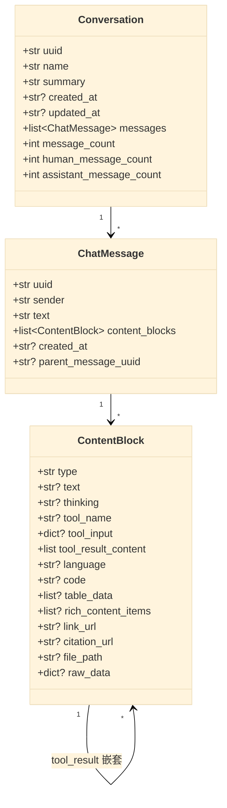

**设计决策**：采用单一 `ContentBlock` 类 + 可选字段，而非 15 个子类。理由：
- 字段重叠度高（大部分类型只用到 2-3 个字段）
- JSON 反序列化时无需工厂模式
- 减少类爆炸（`TextBlock`, `ThinkingBlock`, `ToolUseBlock`...）
- 代价：字段访问缺乏编译期类型安全，需运行时检查 `block.type`

### 4.2 `src/parser.py` — JSON 解析器

**格式检测策略**（v2 优化后）：

```python
content = f.read()           # 一次性读入
stripped = content.lstrip()  # 跳过 BOM + 空白
if stripped.startswith("["):  # JSON 数组
    json.loads(content)
elif stripped.startswith("{"): # JSONL
    _parse_jsonl(content)
```

v1 使用逐字节 `f.read(1)` 循环检测首字符 — 已优化为 `lstrip()` + `startswith()`。

**容错策略**：缺失字段给默认值，JSONL 坏行跳过并打印警告，不中断解析。

### 4.3 `src/content_renderer.py` — HTML 渲染器

核心函数 `render_content_block()` 采用 if/elif 分发模式，将 15 种内容块类型渲染为 HTML 片段。

**关键设计决策**：

1. **HTML 转义 + 客户端解码**：文本块先 `html_escape()` 再嵌入 HTML，前端 `decodeHtmlEntities()` + `marked.parse()` 渲染。这避免了 Markdown 中的 HTML 标签破坏页面结构。

2. **递归渲染**：`tool_result` 的 `content` 字段是嵌套的子内容块数组，渲染时递归调用 `render_content_block()`。

3. **工具图标映射**：模块级常量 `TOOL_ICON_MAP` 将 Claude 的图标名（`globe`, `search`）映射到 emoji。

### 4.4 `src/renderer_md.py` — Markdown 导出

独立的 Markdown 渲染管道，输出带 YAML frontmatter 的 GFM 兼容 Markdown：
- Thinking 用 `<details>` HTML 标签（GitHub/VS Code 原生支持）
- 工具调用用 `>` blockquote + 嵌套代码块
- 对话摘要包含 `## 📋 对话摘要` 章节

### 4.5 `app.py` — Flask 入口

**全局状态管理**：

```python
conversations: list[Conversation] = []    # 对话列表
_conversation_index: dict = {}           # UUID → Conversation (O(1))
user_profile: dict = {}                  # memories.json 内容
```

**端口冲突处理**（v2）：

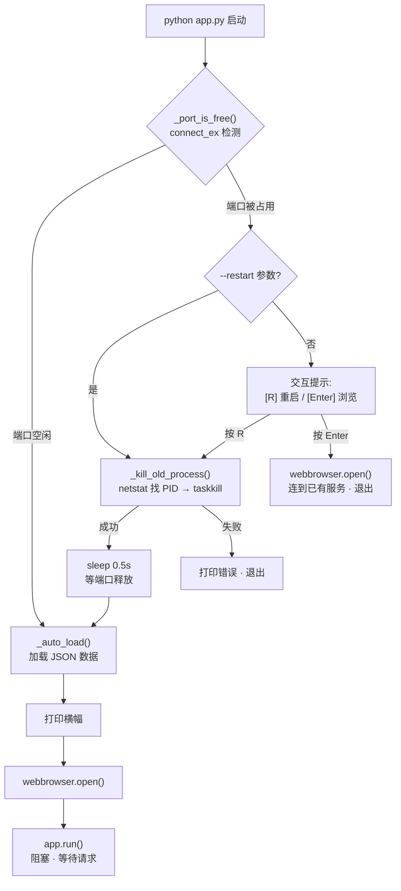

---

## 5. 前端架构

### 5.1 状态管理

```javascript
const state = {
    conversations: [],       // 对话列表缓存
    currentConvUuid: null,   // 当前选中对话
    theme: 'light',          // light / dark
    searchQuery: '',         // 搜索过滤词
};
```

采用最小化全局状态 + DOM 驱动的设计，避免引入 Redux/Vuex 级别的状态管理。

### 5.2 关键交互流程

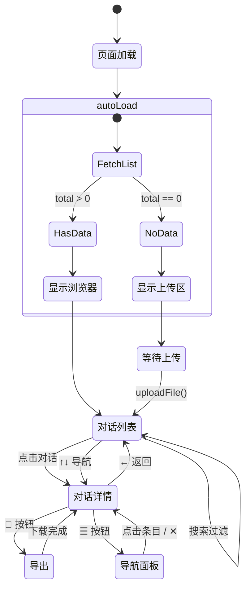

### 5.3 渲染后处理管线

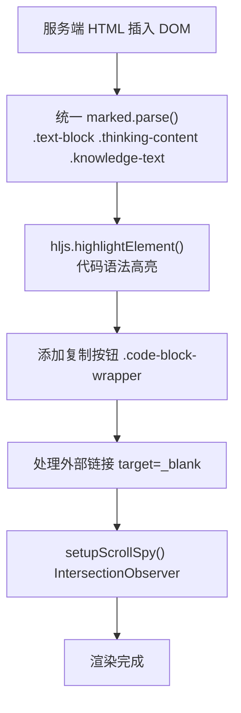

### 5.5 "加载全部"分块渐进渲染

> **测试集数据**：本节中的消息数（1700+/1000+）和性能时间（5-10s）均基于开发测试集（最大单对话 1753 条消息），实际体验因数据规模而异。

大对话（1000+ 条消息）一次性渲染会冻结浏览器 5-10 秒。解决方案：

```javascript
// 核心工具
function yieldToBrowser() {
    return new Promise(resolve => setTimeout(resolve, 0));
}

// 分块循环（30 条/块）
for (let i = 0; i < messages.length; i += 30) {
    const chunk = messages.slice(i, i + 30);
    chunk.forEach(msg => createMessageElement(msg));
    processChunkElements(newElements);  // 只对新元素做 marked.js
    await yieldToBrowser();              // 让出主线程
}
```

**性能对比**：

| 指标 | 同步全量 | 分块渐进 |
|------|---------|---------|
| 首屏可交互 | 锁定 5-10s | 每 30 条停顿 ~50ms |
| 用户可中断 | 否 | 是 |
| highlight.js | 全量扫描 | requestIdleCallback 延迟执行 |

### 5.6 消息导航性能优化

**旧方案**：`rebuildOutlineFromDOM()` 从 DOM 暴力提取数据
- `$$('.message')` 遍历全部消息元素
- `extractPreview()` 对每条消息做 `innerHTML` 解析（1700 × 10-50KB HTML）
- 临时 DOM 创建 + querySelectorAll + remove → O(n) 性能灾难

**新方案**：数据驱动，从 `state.messageIndex` 构建
- 服务端预计算 `message_index`（uuid / sender / preview / timestamp）
- `syncOutline()` 用 UUID→索引 Map 匹配已渲染消息
- `DocumentFragment` 批量插入 DOM
- >500 条目时分块异步构建（`requestAnimationFrame` 让出主线程）
- Scroll spy 用 `_outlineUuidToIdx` Map 实现 O(1) 查找
- `_currentVisibleUuid` 缓存可见状态，打开面板时无需遍历

### 5.7 主题切换极致优化

**核心问题**：1700+ 条消息的 DOM（~8.5 万个节点）在主题切换时全部需要样式重算和重绘。

**三层优化**：

| 层级 | 方案 | 说明 |
|------|------|------|
| CSS `content-visibility: auto` | `.message` 元素跳过视口外渲染 | O(1700)→O(20) |
| 放弃代码高亮主题切换 | 固定 `github-dark` 主题 | 消除 CSSOM 重建 |
| 冻结过渡动画 | `.theme-switching` 类 + `offsetHeight` 强制同步 | 0.2s 渐变→单帧完成 |

**最终 `applyTheme()` 路径**：
```javascript
classList.add('theme-switching')    // 冻结所有 CSS transition
setAttribute('data-theme', 'dark')   // 唯一状态变更
void document.body.offsetHeight      // 强制同步渲染（无过渡）
classList.remove('theme-switching')  // 恢复过渡动画
```

**失败的尝试**：
- `startViewTransition`：全页截图在 1700 条消息下加倍渲染压力
- `<link disabled>` 翻转：仍触发 CSS 规则重匹配
- 双 rAF 延迟 hl 切换：代码色变化分两帧，视觉"诡异"

### 5.8 对话内搜索

**架构**：服务端全文搜索 + 前端气泡级导航

```
用户输入 → 防抖 250ms → GET /api/conv/<uuid>/search?q=关键词
  → _get_message_fulltext() 遍历全部 content_blocks
  → fulltext.lower().find(query)  Python str.find (Boyer-Moore-Horspool)
  → 返回 UUID + 上下文片段 + 页码
  → 前端以消息气泡为单位 ↑↓ 导航，单气泡高亮
```

**已修复的两个隐蔽 Bug**：
1. UUID 排序导致结果随机：`results.sort(key=lambda r: r["uuid"])` — UUID 是随机的，已删除排序，保持对话时间线顺序
2. `_get_message_fulltext` 提前 return：assistant 消息的 `msg.text` 只含第一个文本块，工具调用后的全部内容被截断。修复为始终遍历 `content_blocks`

### 5.4 性能优化

| 优化项 | 措施 |
|--------|------|
| `decodeHtmlEntities` | 复用单一 `<textarea>`，避免每次创建 DOM |
| `applyListData` | `autoLoad` 和 `loadConversationList` 共享数据应用逻辑 |
| `IntersectionObserver` | 切换对话时 `disconnect()` + 重新 `observe()`，修复内存泄漏 |
| 3× marked.parse 循环 | 统一为选择器数组迭代 |
| `_find_conversation` | UUID 字典索引，O(1) 替代 O(n) |

---

## 6. API 参考

| 方法 | 路由 | 请求 | 响应 |
|------|------|------|------|
| `GET` | `/` | — | `text/html` |
| `POST` | `/api/upload` | `multipart/form-data` (file) | `{success, conversation_count, message_count}` |
| `GET` | `/api/list` | — | `{conversations: [{uuid, name, date, updated_at, message_count}], total, has_profile}` |
| `GET` | `/api/conv/<uuid>` | `?limit=50&offset=0` | `{uuid, name, summary, messages, message_index, has_more, total_messages}` |
| `GET` | `/api/conv/<uuid>/search?q=` | query string | `{results: [{uuid, sender, preview, page}], total}` |
| `GET` | `/api/conv/<uuid>/export` | — | `text/markdown` (Content-Disposition: attachment) |
| `GET` | `/api/search?q=` | query string | `{results: [...], total}` |
| `GET` | `/api/profile` | — | `{has_profile, profile_markdown, account_uuid}` |
| `GET` | `/api/stats` | — | `{conversation_count, message_count, content_types: [{type, count}]}` |

---

## 7. 15 种内容块类型映射

### 类型分布

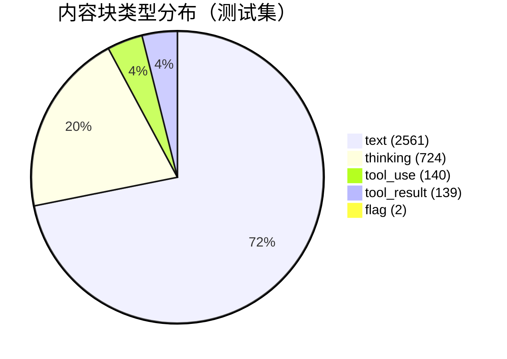

### 完整映射表

| 类型 | 出现次数 | 渲染方式 |
|------|---------|---------|
| `text` | 2561 | HTML 转义 → marked.js → `<div class="text-block">` |
| `thinking` | 724 | `<details><summary>💭</summary>` 折叠面板 |
| `tool_use` | 140 | 工具调用卡片（名称 + 输入参数 JSON） |
| `tool_result` | 139 | 工具结果卡片（递归渲染子内容） |
| `flag` | 2 | 标签徽章（info/warning/error） |
| `code_block` | 0* | `<pre><code>` + highlight.js |
| `json_block` | 0* | 格式化 JSON 代码块 |
| `table` | 0* | HTML `<table>` |
| `rich_content` | 0* | 信息通知卡片 |
| `rich_link` | 0* | 链接预览卡片 |
| `web_search_citation` | 0* | 搜索引用 |
| `webpage_metadata` | 0*† | favicon + 域名 |
| `knowledge` | 0*† | 知识库结果卡片 |
| `local_resource` | 0*† | 文件引用 |
| `application/vnd.ant.react` | 0* | Artifact 占位 |

> \* 在当前数据集中未出现，但解析器和渲染器已预留支持  
> \† 通常嵌套在 `tool_result` 中

### 嵌套关系

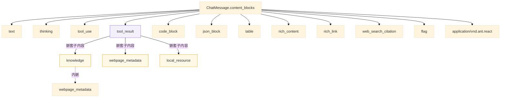

---

## 8. 配色系统

### 亮色模式（暖纸 + 冰蓝）

```
页面:     #f5f0eb   暖纸色
侧栏:     #d4ddd2   鼠尾草绿
代码块:   #edf2f7   冰雾蓝
用户气泡: #e8ecf2   蓝灰
Claude:   #fdfaf7   微暖白
```

### 热带语法高亮

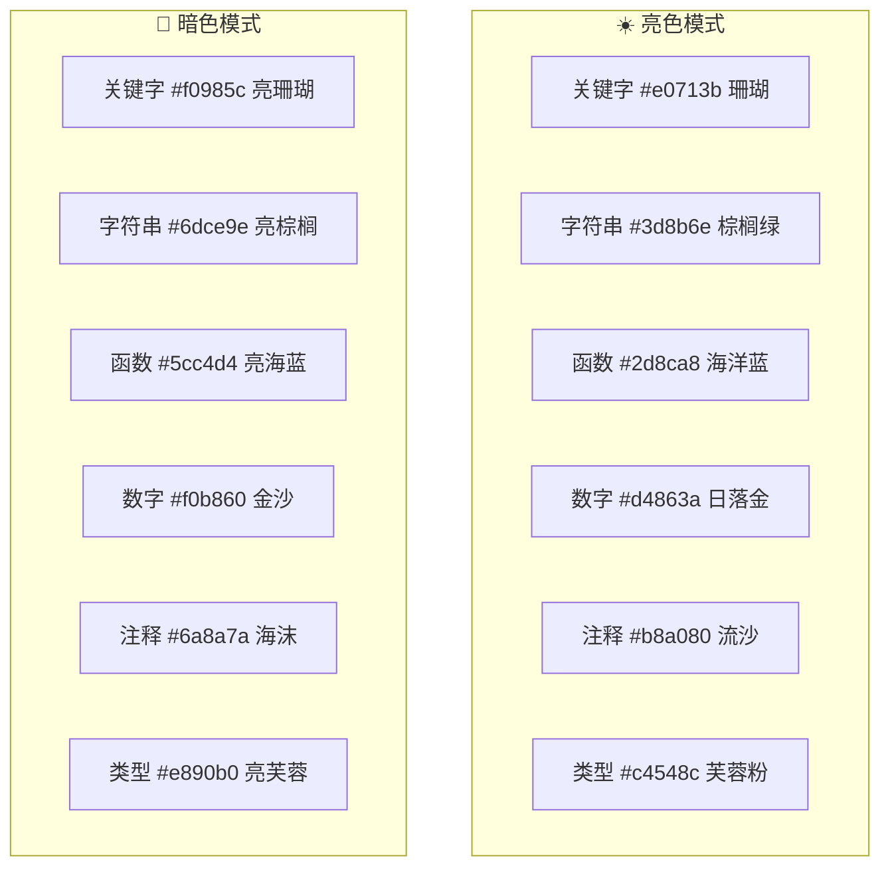

---

## 9. 扩展指南

### 添加新的内容块类型

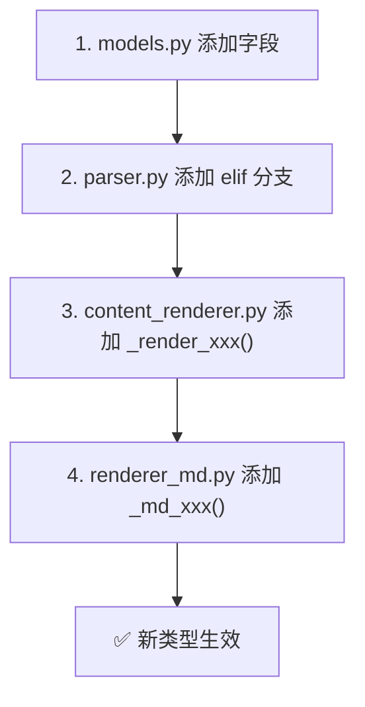

具体步骤：

1. `src/models.py` — 在 `ContentBlock` 中添加对应字段
2. `src/parser.py` — 在 `_parse_content_block()` 添加 `elif block_type == "xxx":`
3. `src/content_renderer.py` — 添加 `_render_xxx()` + 在分发链注册
4. `src/renderer_md.py` — 添加 `_md_xxx()` + 在分发链注册

### 添加新的输出格式

在 `src/` 下新建 `renderer_<format>.py`，实现 `export_conversation_<format>(conv) -> str`，然后在 `app.py` 添加对应的 API 路由。

---

## 10. 已知限制

1. **大 DOM 物理极限**：1700+ 条消息加载后主题切换仍有轻微延迟——浏览器需遍历样式树确认受影响元素。彻底消除需虚拟滚动（只渲染视口内消息），但会大幅改变架构
2. **`content-visibility: auto` 滚动条**：未渲染的消息用 `contain-intrinsic-size: 300px` 估算高度，首次滚动时滚动条可能微调（`auto` 关键字会在渲染后记住实际高度）
3. **图片不渲染**：`tool_result` 中的 base64 图片显示为占位文本
4. **Artifact 组件**：`application/vnd.ant.react` 类型仅显示占位符
5. **单用户单实例**：Flask 开发服务器仅适合本地使用，未做并发处理
6. **highlight.js CDN 依赖**：离线环境下代码高亮失效（阅读不受影响）
7. **代码高亮主题固定**：为消除主题切换 CSSOM 重建开销，代码块始终使用 github-dark 配色
