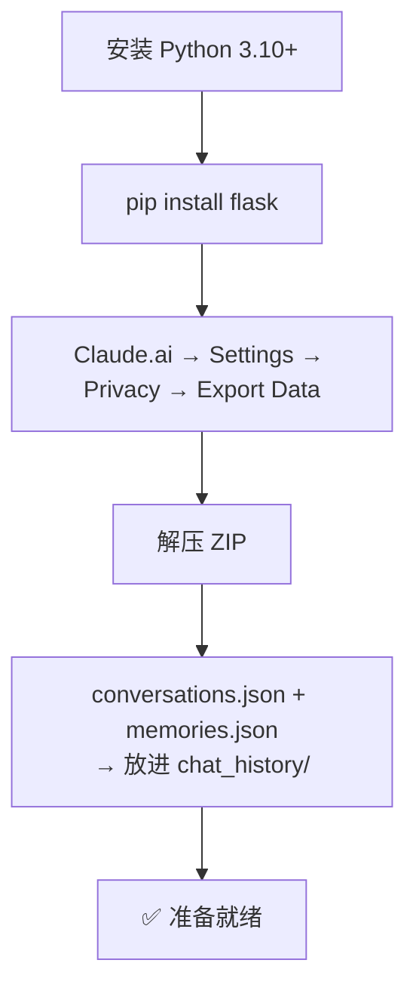
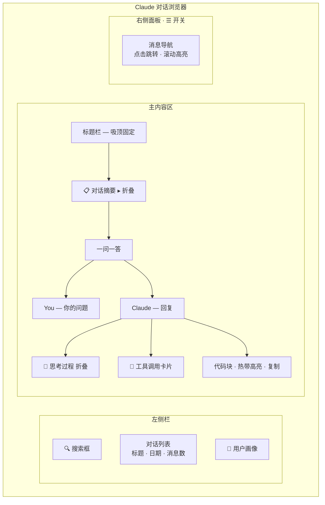
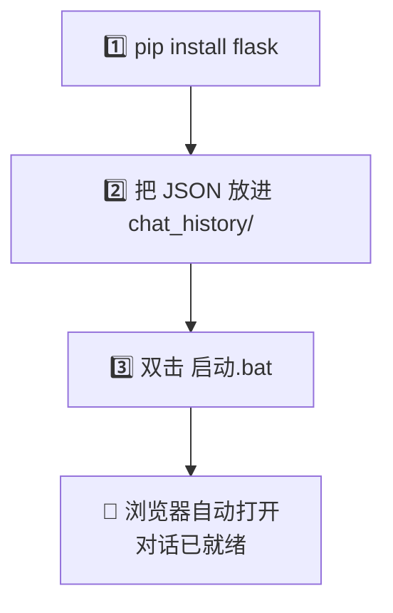
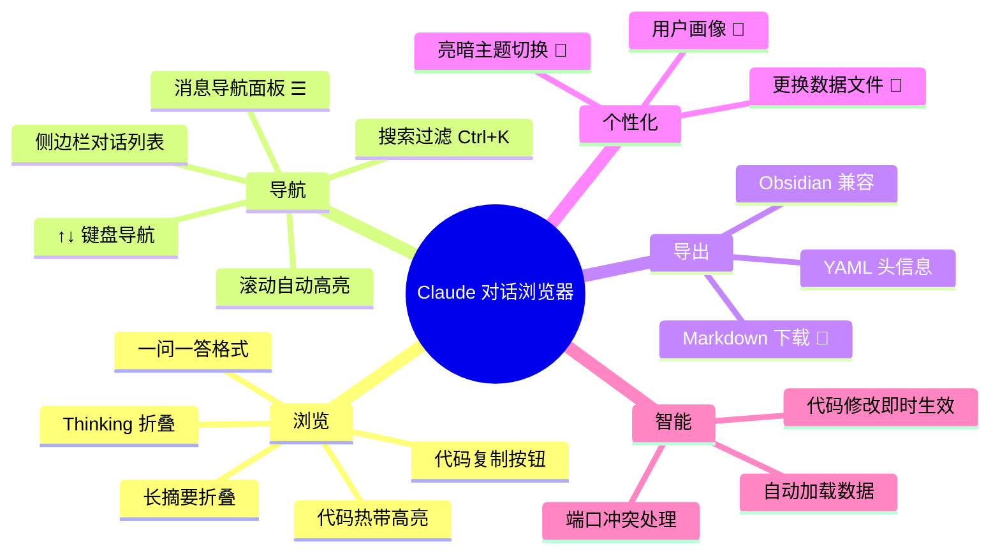

# Claude 对话浏览器 — 用户手册

## 这是什么

一个把 Claude 导出记录变成好看网页的工具。双击 bat，浏览器打开，拖入 JSON/JSONL 文件，就能像刷 Claude 聊天记录一样浏览你的所有对话。

**支持两种数据源**：
- **Claude.ai**：从 Settings → Privacy → Export Data 导出的 `conversations.json`
- **Claude Code**：`.jsonl` 格式的 Claude Code 会话记录

---

## 准备工作

### 1. 安装 Python

你的电脑需要 Python 3.10 或更高版本。  
如果还没装：[python.org/downloads](https://www.python.org/downloads/)

### 2. 安装依赖

打开终端（PowerShell 或 CMD），进入项目目录，运行：

```bash
pip install flask
```

就这一个依赖。

### 3. 获取 Claude 对话数据

1. 打开 [claude.ai](https://claude.ai)
2. 左下角头像 → **Settings**（设置）
3. 左侧 **Privacy**（隐私）
4. 点击 **Export Data**（导出数据）
5. 等几分钟，下载 ZIP 文件
6. 解压，找到 `conversations.json` 和 `memories.json`
7. 把它们放到 `chat_history` 文件夹里（本项目已建好）



---

## 启动

```
双击 启动.bat
```

浏览器会自动打开 `http://localhost:5000`。  
如果 `chat_history` 文件夹里有数据，会**自动加载**，无需任何操作。

---

## 界面一览



---

## 功能详解

### 📋 浏览对话

点击左侧任意对话 → 右侧显示一问一答。

每条消息分为三部分：
- **消息头**：`You`（蓝色）或 `Claude`（紫色）+ 时间
- **思考过程**：默认折叠，点击 `💭 思考过程` 展开
- **正文**：Markdown 渲染，代码高亮

### 📐 对话摘要

标题下方有一个 `📋 对话摘要 ▸` 按钮——点击展开，查看 Claude 自动生成的对话概述。再点收起。

### 🎨 代码块

代码块展示在浅蓝色背景上，用**热带配色**高亮：
- 鼠标悬停代码块 → 右上角出现 **📋 复制** 按钮
- 点击复制 → 变为 **✅ 已复制**，2 秒后恢复

### ☰ 消息导航

长对话（10+ 条消息）的好帮手：

1. 点击右上角 **☰** 按钮
2. 右侧滑出导航面板，展示每条消息的预览
3. **点击任意条目** → 页面跳转到该消息
4. **滚动对话** → 导航面板自动高亮当前所在位置
5. 再点 **☰** 或 **✕** 关闭

### 📄 导出对话

把当前对话下载为 Markdown 文件：

1. 打开一个对话
2. 点击右上角 **📄** 按钮
3. 浏览器自动下载 `.md` 文件

导出文件包含：
- YAML 头信息（标题、日期、消息数）
- 完整一问一答
- 思考过程（可折叠）
- 工具调用记录
- 代码块（带语言标记）

可在 Obsidian、VS Code、Typora、GitHub 中完美阅读。

### 👤 用户画像

如果 `chat_history` 里有 `memories.json`，左侧会出现 **👤** 按钮：
- 点击 → 弹出 Claude 根据你的对话历史总结的用户画像
- 按 `Esc` 或点遮罩关闭

### 🔍 对话内搜索

在对话标题栏下方有一个搜索框（橙色边框），可在**当前对话内部**搜索关键词：

- 输入关键词 → 自动搜索（无需回车）
- 结果按对话时间线排列
- `↑` `↓` 在匹配结果间跳转，当前气泡脉冲高亮
- `✕` 按钮清除搜索内容
- 未渲染的消息会按需加载对应页

### 📥 加载全部

长对话（50 条以上）的"加载更多"按钮旁边有一个"加载全部"按钮：

- 点击 → 分批渐进加载所有剩余消息（30 条/批）
- 按钮实时显示进度：`加载全部… 600/1753`
- 加载过程中仍可正常滚动、搜索
- 完成后按钮自动消失

### 🔍 搜索对话列表

- **搜索框**在左侧顶部
- 输入关键词 → 实时过滤对话列表（匹配标题和摘要）
- 快捷键 `Ctrl+K` 聚焦搜索框
- 按 `Esc` 清除搜索

### ⌨️ 键盘快捷键

| 快捷键 | 功能 |
|--------|------|
| `Ctrl+K` | 聚焦搜索框 |
| `↑` `↓` | 对话内搜索：在匹配结果间跳转 |
| `Esc` | 清除搜索 / 关闭画像弹窗 |

### 🌙 亮暗主题

右上角 **🌙** 按钮一键切换亮色/暗色模式。  
暗色模式下代码块背景变为深海绿，所有色彩自动适配。
> 注：长对话（1000+ 条消息）切换主题可能有短暂延迟，这是大 DOM 的物理极限，后续版本将引入虚拟滚动彻底解决。

---

## 更换数据

如果想换一批对话看：

1. 点击左侧顶部的 **📂** 按钮
2. 选择新的 `conversations.json`
3. 解析完成 → 列表自动更新

或者直接替换 `chat_history` 文件夹里的文件，重启 `启动.bat`。

---

## 常见问题

### Q: 双击 bat 闪退？

A: 打开 CMD，`cd` 到项目目录，手动运行 `python app.py` 看报错信息。通常是没装 Python 或 flask。

### Q: 浏览器打开是空白？

A: 确认 `chat_history/conversations.json` 存在。如果是拖拽上传，确认拖的是 `.json` 文件。

### Q: 中文乱码？

A: 不会。全链路 UTF-8：Python 读写、Flask 响应、HTML meta 标签三重保障。

### Q: 对话太多，列表很长怎么办？

A: 用搜索框（`Ctrl+K`）快速定位。输入对话标题的任意关键词即可过滤。

### Q: 想在当前对话内搜索某个词？

A: 打开对话后，标题栏下方有橙色边框的搜索框，直接输入即可在对话内部搜索。`↑↓` 键在结果间跳转。

### Q: Claude Code 的 .jsonl 文件能看吗？

A: 完全支持。拖入 `.jsonl` 文件即可，自动识别格式并解析 27 种事件类型。

### Q: 代码高亮不太对？

A: 需要联网——highlight.js 从 CDN 加载。离线时代码块只显示基本格式，不影响阅读。

### Q: 能导出所有对话吗？

A: 目前每次只能导出当前对话。如需批量导出，后续版本会支持。

---

## 文件结构

```
json_reader/
├── 启动.bat                 ← 双击启动
├── app.py                   ← Flask 入口
├── requirements.txt         ← pip 依赖
├── chat_history/            ← 放 JSON 数据
│   ├── conversations.json
│   └── memories.json
├── docs/
│   ├── 用户手册.md           ← 你正在看的
│   └── 技术文档.md
├── src/                     ← Python 源码
├── static/                  ← CSS + JS
└── templates/               ← HTML 模板
```

---

## 快捷上手三步



搞定了。👌

---

## 功能速查


